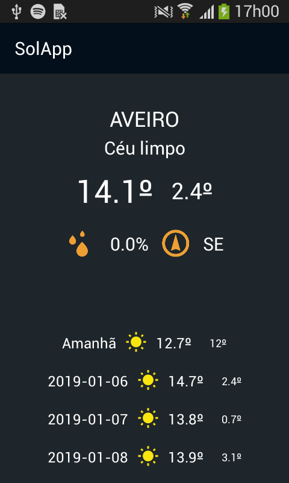
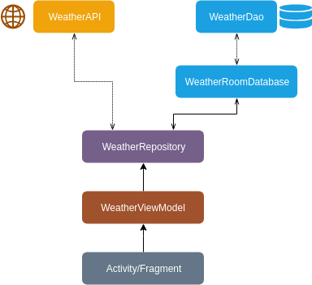

# WeatherApp
ICM Homework using Weather API and Android Architectural Components

## Funcionalidade Implementada
A aplicação implementada tem como principal funcionalidade mostrar ao seu utilizador a previsão da meteorologia para uma dada cidade.
Para isso, recorreu-se ao uso da API do IPMA (Instituto Português do Mar e Atmosfera) que disponibiliza gratuitamente dados confiaveis da previsão meteorologica até 5 dias.
Quando se abre a aplicação é possível ver o estado do tempo para o dia atual assim como temperatura máxima e mínima. Além disso, é possivel visualizar ainda a probabilidade de percipitação e direção do vento.
É apresentada ainda uma lista com a previsão para os dias seguintes, apresentando para cada dia, o estado do tempo através de uma imagem, as máximas e as minimas.

## Aquitectura
A aplicação tem a seguinte arquitetura de implementação, sendo que o repositório (WeatherRepository) gere como é que os dados são obtidos, ou seja, se vai buscar à API ou à base de dados local.
Recorreu-se ao tutorial [The Missing Google Sample of Android “Architecture Components” Guide](https://proandroiddev.com/the-missing-google-sample-of-android-architecture-components-guide-c7d6e7306b8f) para perceber o funcionamento do repositório e a gestão da obtenção de dados,
e ainda à [Lesson 14 do Android Developer Advanced Course Practicals](https://google-developer-training.github.io/android-developer-advanced-course-practicals/unit-6-working-with-architecture-components/lesson-14-room,-livedata,-viewmodel/14-1-a-room-livedata-viewmodel/14-1-a-room-livedata-viewmodel.html)
> 
- A ligação à API do IPMA e a obtenção dos seus dados: usando Retrofit2 e GSON
- Criação da base de dados local: em SQLite usando Room
- ViewModel usando LiveData

## Limitações
A aplicação está muito pobrezinha, pois só está a fazer display da previsão do tempo para uma localidade.
Seria previsto implementar uma lista com todas as localidades e consoante as localidades escolhidas na lista, fazer o display dos respetivos dados, ou então apresentar os dados relevantes de cada localidade num RecyclerView.
É uma aplicação muito básica que apenas mostra os dados guardados no repositório, não havendo qualquer tipo de interação complexa com o utilizador.
No que toca ao refresh da aplicação de 15 em 15 minutos para ir buscar dados mais recentes à API, creio que não esteja totalmente bem implementado

## Cuidados
Convém haver ligação à rede quando se corre o projeto pela primeira vez para que os dados vindos da API sejam guardados, e ainda ter o cuidado de todos os dias haver esta ligação para haver uma atualização dos dados das previsões dos próximos dias
